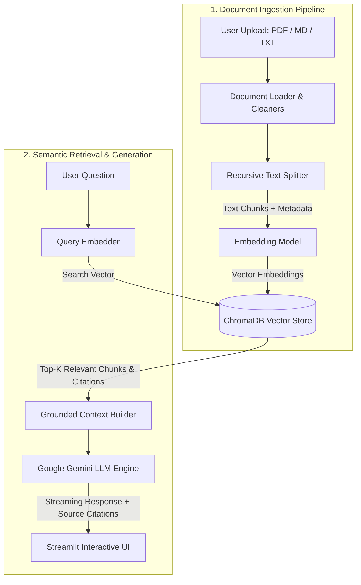

# 🧠 DocuMind

> **Local-First RAG (Retrieval-Augmented Generation) & Document Knowledge Base**  
> Smart document question-answering over PDF, Markdown, and TXT files with precise source citations, anti-hallucination guardrails, and real-time streaming LLM responses.

[](https://python.org)
[](https://streamlit.io)
[](https://trychroma.com)
[](https://aistudio.google.com)
[](tests/)
[](LICENSE)

---

## 🌟 Key Features

- 📄 **Multi-Format Ingestion**: Seamlessly ingest `.pdf`, `.md`, and `.txt` documents simultaneously.
- ✂️ **Recursive Smart Chunking**: Context-aware splitting across paragraphs, sentences, and words with dynamic character overlap to preserve semantic context.
- 🎯 **Persistent Local Vector Store**: Powered by **ChromaDB** for ultra-fast local semantic retrieval without complex external database dependencies.
- 📚 **Grounded Citations**: Every generated answer is paired with page numbers, source filenames, and relevancy similarity scores to prevent AI hallucinations.
- ⚡ **Real-Time Streaming**: Responsive typewriter-style streaming responses powered by Google Gemini.
- 🧪 **Production-Grade & Tested**: Modular architecture with automated unit tests (`pytest`), containerization (`Dockerfile` & `docker-compose.yml`), and modern packaging via `uv`.

---

## 🏛️ System Architecture



---

## 🛠️ Tech Stack

| Component | Technology | Description |
|---|---|---|
| **Language** | Python 3.12 | Managed using modern, blazing-fast `uv` packaging |
| **Frontend / UI** | Streamlit | Clean, responsive web dashboard & chat interface |
| **Vector Database** | ChromaDB | Embedded local vector store with Cosine similarity |
| **LLM Provider** | Google Gemini (`gemini-2.5-flash`) | Low latency, high reasoning quality, and streaming support |
| **Embedding Engine** | `text-embedding-004` / Fast ONNX | Gemini embedding model with automatic local fallback |
| **PDF Extraction** | `pypdf` | Lightweight, pure Python extraction without heavy C++ dependencies |
| **Testing** | `pytest` | Unit tests covering document loaders, chunkers, and vector store operations |
| **Containerization** | Docker & Docker Compose | Single-command deployment anywhere |

---

## 🚀 Getting Started

### 1. Prerequisites
- Python 3.12+ installed, OR [uv](https://astral.sh/uv) (recommended).
- A Google Gemini API Key (free tier available at [Google AI Studio](https://aistudio.google.com/)).

### 2. Clone the Repository
```bash
git clone https://github.com/Jansky0/documind.git
cd documind
```

### 3. Setup Environment & Dependencies

#### Option A: Using `uv` (Recommended — Fast & Clean)
```bash
# Sync and install all dependencies in a virtual environment
uv sync

# Copy environment configuration template
cp .env.example .env
```

#### Option B: Using Standard `venv` & `pip`
```bash
python3 -m venv .venv
source .venv/bin/activate
pip install -r requirements.txt
cp .env.example .env
```

### 4. Configure Your API Key
Open `.env` and add your Google Gemini API Key:
```env
GEMINI_API_KEY=AIzaSy...
GEMINI_MODEL=gemini-2.5-flash
```
*(Note: You can also input or change your API Key directly within the Streamlit sidebar UI).*

### 5. Launch the Application
```bash
# Running with uv
uv run streamlit run app.py

# Or if virtualenv is activated
streamlit run app.py
```
Open your browser and navigate to: `http://localhost:8501`

---

## 🐳 Running with Docker

Run DocuMind in an isolated container with Docker Compose:
```bash
# Setup environment file
cp .env.example .env

# Build and start container
docker compose up --build
```
Access the application at `http://localhost:8501`.

---

## 🧪 Running Unit Tests

DocuMind includes a complete unit test suite validating text parsing, chunking boundary logic, and vector store operations:
```bash
uv run pytest -v
```

Expected output:
```text
tests/test_rag.py::test_recursive_split_text PASSED
tests/test_rag.py::test_load_and_chunk_document PASSED
tests/test_rag.py::test_vector_store_crud PASSED
```

---

## 📁 Project Structure

```text
documind/
├── .env.example              # Environment variables template
├── .gitignore                # Git ignore rules
├── Dockerfile                # Production Docker container definition
├── docker-compose.yml        # Docker service orchestration
├── pyproject.toml            # Project dependencies & metadata
├── README.md                 # Project documentation
├── app.py                    # Streamlit web UI entrypoint
├── data/
│   ├── chroma_db/            # Local ChromaDB persistent vector data
│   ├── sample_documents/     # Sample documents for quick testing
│   └── uploads/              # Uploaded document staging folder
├── src/
│   ├── __init__.py
│   ├── config.py             # Global configuration & path management
│   ├── document_loader.py    # Multi-format document parsing & recursive chunking
│   ├── rag_engine.py         # Grounded prompt construction & Gemini streaming
│   └── vector_store.py       # ChromaDB wrapper with embedding support
└── tests/
    ├── __init__.py
    └── test_rag.py           # Pytest test cases
```

---

## 📄 License
This project is open-source and distributed under the [MIT License](LICENSE).
