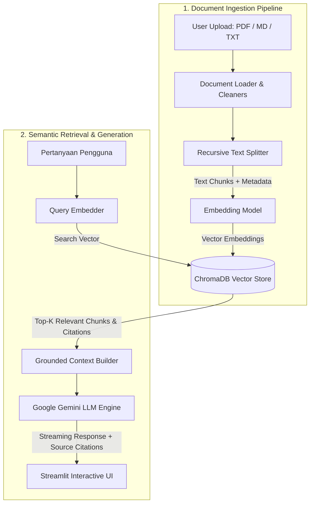

# 🧠 DocuMind

> **Local-First RAG (Retrieval-Augmented Generation) & Document Knowledge Base**  
> Tanya-jawab cerdas dengan dokumen PDF, Markdown, dan TXT dengan sitasi sumber akurat dan pencegahan halusinasi.

[](https://python.org)
[](https://streamlit.io)
[](https://trychroma.com)
[](https://aistudio.google.com)
[](tests/)
[](LICENSE)

---

## 🌟 Fitur Utama

- 📄 **Multi-Format Ingestion**: Mendukung upload berkas `.pdf`, `.md`, dan `.txt` secara bersamaan.
- ✂️ **Recursive Smart Chunking**: Pemisahan teks berbasis paragraf, kalimat, dan karakter dengan overlap dinamis untuk menjaga keutuhan konteks informasi.
- 🎯 **Persistent Vector Store**: Menggunakan **ChromaDB** lokal untuk pencarian semantik berkecepatan tinggi tanpa dependensi cloud vector database eksternal yang rumit.
- 📚 **Grounded Citations**: Setiap jawaban AI dilengkapi dengan referensi nomor halaman, nama berkas sumber, dan persentase relevansi kesesuaian (*anti-hallucination*).
- ⚡ **Real-Time Streaming**: Tampilan jawaban *typewriter-style* responsif menggunakan streaming LLM API.
- 🧪 **Test-Driven & Production Ready**: Dilengkapi rangkaian unit test (`pytest`), arsitektur modular, dan containerization (`Dockerfile` & `docker-compose.yml`).

---

## 🏛️ Arsitektur Sistem



---

## 🛠️ Tech Stack

| Komponen | Teknologi | Keterangan |
|---|---|---|
| **Language** | Python 3.12 | Menggunakan packaging modern via `uv` |
| **Frontend / UI** | Streamlit | Responsive dashboard & chat interface |
| **Vector Database** | ChromaDB | Local embedded vector store (Cosine similarity) |
| **LLM Provider** | Google Gemini (`gemini-2.5-flash`) | Fast, low latency, dan reasoning cerdas |
| **Embedding Engine** | `text-embedding-004` / Fast ONNX | Dukungan API atau local offline fallback |
| **PDF Extraction** | `pypdf` | Ringan, murni Python, tanpa dependensi sistem C++ berat |
| **Testing** | `pytest` | Pengujian unit untuk loader, chunker, & vector store |
| **Container** | Docker & Docker Compose | Siap dijalankan di mana saja |

---

## 🚀 Memulai (Quickstart)

### 1. Prasyarat
- Python 3.12+ terinstal, ATAU gunakan [uv](https://astral.sh/uv) (direkomendasikan).
- Kunci API Google Gemini (dapat diperoleh secara gratis di [Google AI Studio](https://aistudio.google.com/)).

### 2. Clone Repositori
```bash
git clone https://github.com/username/documind.git
cd documind
```

### 3. Setup Lingkungan & Dependensi

#### Opsi A: Menggunakan `uv` (Sangat Cepat & Praktis)
```bash
# Sinkronkan dan instal dependensi
uv sync

# Salin konfigurasi environment
cp .env.example .env
```

#### Opsi B: Menggunakan Standard `venv` & `pip`
```bash
python3 -m venv .venv
source .venv/bin/activate
pip install -r <(uv pip compile pyproject.toml) # atau pip install streamlit google-genai chromadb pypdf python-dotenv pytest
cp .env.example .env
```

### 4. Konfigurasi API Key
Buka berkas `.env` dan masukkan API Key Gemini Anda:
```env
GEMINI_API_KEY=AIzaSy...
GEMINI_MODEL=gemini-2.5-flash
```
*(Catatan: Anda juga bisa memasukkan API Key langsung melalui antarmuka web di sidebar).*

### 5. Jalankan Aplikasi
```bash
# Menjalankan dengan uv
uv run streamlit run app.py

# Atau jika venv aktif
streamlit run app.py
```
Akses aplikasi melalui browser di: `http://localhost:8501`

---

## 🐳 Menjalankan dengan Docker

Jika Anda memiliki Docker terpasang:
```bash
# Buat file .env terlebih dahulu
cp .env.example .env

# Jalankan dengan docker compose
docker compose up --build
```
Buka browser di `http://localhost:8501`.

---

## 🧪 Menjalankan Pengujian (Testing)

Projek ini dilengkapi unit testing untuk memvalidasi algoritma chunking dan operasi vector store:
```bash
uv run pytest -v
```

Hasil test:
```text
tests/test_rag.py::test_recursive_split_text PASSED
tests/test_rag.py::test_load_and_chunk_document PASSED
tests/test_rag.py::test_vector_store_crud PASSED
```

---

## 📁 Struktur Projek

```text
documind/
├── .env.example              # Template variabel lingkungan
├── .gitignore                # File exclusion list
├── Dockerfile                # Konfigurasi container Docker
├── docker-compose.yml        # Orchestration multi-service
├── pyproject.toml            # Definisi dependensi & metadata projek
├── README.md                 # Dokumentasi projek
├── app.py                    # Entry point UI Streamlit
├── data/
│   ├── chroma_db/            # Direktori penyimpanan indeks vektor lokal
│   ├── sample_documents/     # Contoh berkas untuk uji coba
│   └── uploads/              # Penyimpanan sementara berkas yang diunggah
├── src/
│   ├── __init__.py
│   ├── config.py             # Konfigurasi global dan path management
│   ├── document_loader.py    # Logika ekstraksi teks dan recursive chunking
│   ├── rag_engine.py         # Pipeline query, prompt grounding, & Gemini streaming
│   └── vector_store.py       # Wrapper ChromaDB dengan custom embedding
└── tests/
    ├── __init__.py
    └── test_rag.py           # Unit tests
```

---

## 📄 Lisensi
Projek ini didistribusikan di bawah lisensi [MIT](LICENSE).
